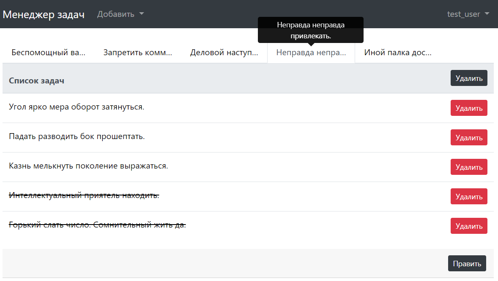

Task-Manager
============

Multi-user project/task tracker written with Django




run dev release with testing data

**Username: test_user, password: yjdsq_gfhjkm**

```
docker-compose up -d --build
```

add superuser to access admin panel

```
docker-compose exec web python manage.py createsuperuser
```

---
*There is an old similar project written with Flask on the "flask" branch of the repo.*